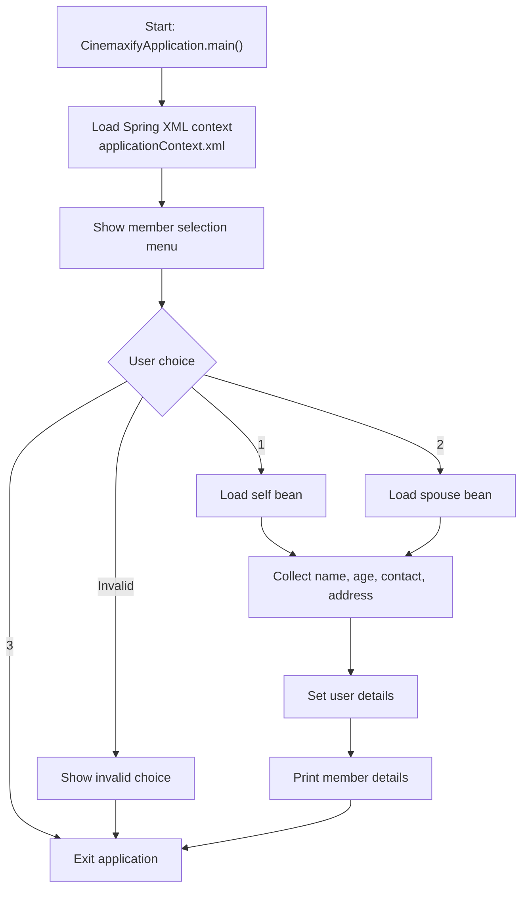

# Cinemaxify

Cinemaxify is a Java 17 console application that uses Spring XML bean configuration to capture membership details for either the primary user or the spouse profile.

## GitHub Metadata

- Suggested repository description: `Java 17 Spring console app that collects Cinemaxify membership details for self or spouse using XML-based dependency injection.`
- Suggested topics: `java`, `java-17`, `spring-framework`, `spring`, `maven`, `xml-configuration`, `dependency-injection`, `junit5`, `oop`, `console-application`, `membership-system`, `learning-project`, `portfolio-project`

## Tech Stack

- Java 17
- Maven
- Spring Framework XML configuration
- JUnit 5

## Project Overview

The application lets a user select which member profile they want to create and then captures the required details:

- `Self` represents the primary account holder.
- `Spouse` represents the spouse profile.
- `MembershipWorkflow` manages the full console interaction and validation.
- `applicationContext.xml` wires `self` and `spouse` as Spring beans.

## Current Flow

1. The application starts in `CinemaxifyApplication`.
2. Spring loads `applicationContext.xml`.
3. The user selects whether the plan is for self, spouse, or exit.
4. The application asks for name, age, contact number, and address.
5. The selected member bean stores the details.
6. The application prints the entered member information back to the user.

## Flow Diagram



## How To Run

```bash
mvn test
mvn package
java -jar target/cinemaxify-0.0.1-SNAPSHOT.jar
```

If you prefer the Maven Wrapper, use `mvnw.cmd` on Windows or `./mvnw` on Unix-like systems.

## Sample Output

```text
Welcome to the Cinemaxify Application
Please select the member you want the plan for:
1. Self
2. Spouse
3. Exit
Please enter your name:
Please enter your age:
Please enter your contact:
Please enter your address:
Hello Bipin, you have entered the following details for self:
age: 25
contact: 9876543210
address: Pune
```

## Known Limitations

- The application is console-based and does not expose a REST API.
- Member details are stored only for the current runtime.
- There is no persistence, plan pricing, or subscription history in `v1`.

## Why This Repo Exists

This repository is intended as a learning and portfolio project that shows:

- interface-based design
- Spring XML bean configuration
- console-based workflow handling
- basic input validation and automated tests
