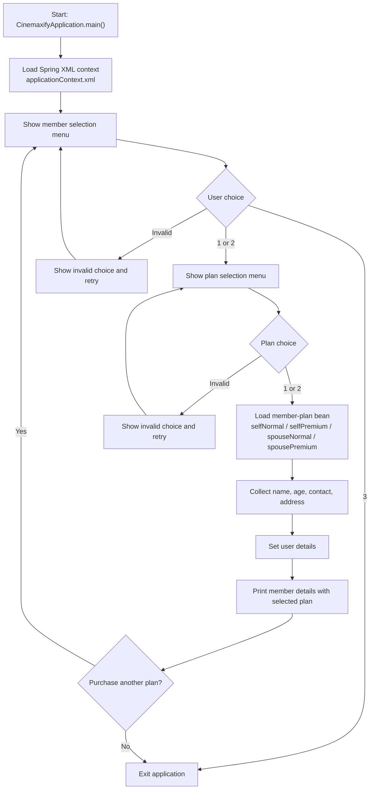

# Cinemaxify

Cinemaxify is a Java 17 console application that uses Spring XML bean configuration to capture membership details for self or spouse and assign either a normal or premium membership plan.

## GitHub Metadata

- Suggested repository description: `Java 17 Spring console app that manages self/spouse membership enrollment with Spring XML bean wiring and normal/premium plan selection.`
- Suggested topics: `java`, `java-17`, `spring-framework`, `spring`, `maven`, `xml-configuration`, `dependency-injection`, `junit5`, `oop`, `console-application`, `membership-system`, `learning-project`, `portfolio-project`

## Tech Stack

- Java 17
- Maven
- Spring Framework XML configuration
- JUnit 5

## Project Overview

The application now lets a user choose both the member profile and the membership plan before capturing the required details:

- `Self` represents the primary account holder.
- `Spouse` represents the spouse profile.
- `NormalPlan` and `PremiumPlan` represent the two available membership plans.
- `MembershipWorkflow` manages the console interaction, validation, and repeated enrollment loop.
- `applicationContext.xml` wires all member-plan combinations as Spring beans.

## Current Flow

1. The application starts in `CinemaxifyApplication`.
2. Spring loads `applicationContext.xml`.
3. The user selects whether the membership is for self, spouse, or exit.
4. The user selects either the normal or premium plan.
5. The application asks for name, age, contact number, and address.
6. The selected member-plan bean stores the details.
7. The application prints the entered member information, including the selected plan.
8. The user can choose to purchase another plan for someone else in the same session.

## Flow Diagram



## How To Run

```bash
mvn test
mvn package
java -jar target/cinemaxify-0.0.1-SNAPSHOT.jar
```

If you prefer the Maven Wrapper, use `mvnw.cmd` on Windows or `./mvnw` on Unix-like systems.

## Sample Output

```text
Welcome to the Cinemaxify Application
Please select the member you want the plan for:
1. Self
2. Spouse
3. Exit
Please select your plan:
1. Normal
2. Premium
Please enter your name:
Please enter your age:
Please enter your contact:
Please enter your address:
Hello Bipin, you have entered the following details for self:
age: 25
contact: 9876543210
address: Pune
plan: normal
Do you want to purchase a plan for someone else?
1. Yes
2. No
```

## Known Limitations

- The application is console-based and does not expose a REST API.
- Member details are stored only for the current runtime.
- There is no persistence, plan pricing, or subscription history in `v2`.

## Why This Repo Exists

This repository is intended as a learning and portfolio project that shows:

- interface-based design
- Spring XML bean configuration
- console-based workflow handling
- basic input validation and automated tests
- incremental improvement from a simple member-selection flow in `v1` to plan-based enrollment in `v2`
